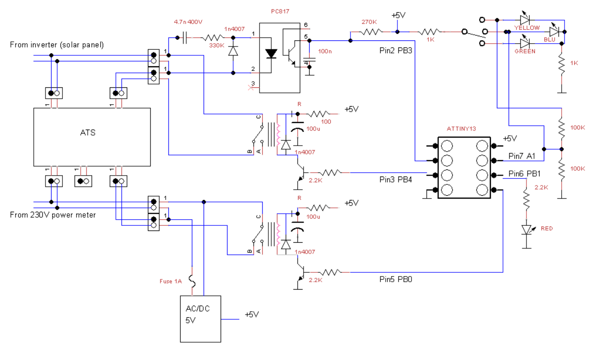

# ats_alternative_controller
external controller for ATS switch

The switch is to sensitive to power spikes due to some kind of power supply. For example I've got a tv that cause a power trip every time I switch on it.
To reduce the sensitivity this controller switch off the inverter power only after 1 second of offline.

ATTINY13 code compiled with https://mcudude.github.io/MicroCore/package_MCUdude_MicroCore_index.json

Power from public grid is supposed to be always available. If not the circuit switch off and the relays let the ATS work as usual. When the circuit is powered the optoinsulator check the power from the inverter. When the inverter power is missing for more than 1 second the relays switch to transfer the power to the public grid for 10 minutes. Whitin the 10 minutes nothing happen. After 10 minutes the circuit return to the usual work checking for power from the inverter.
